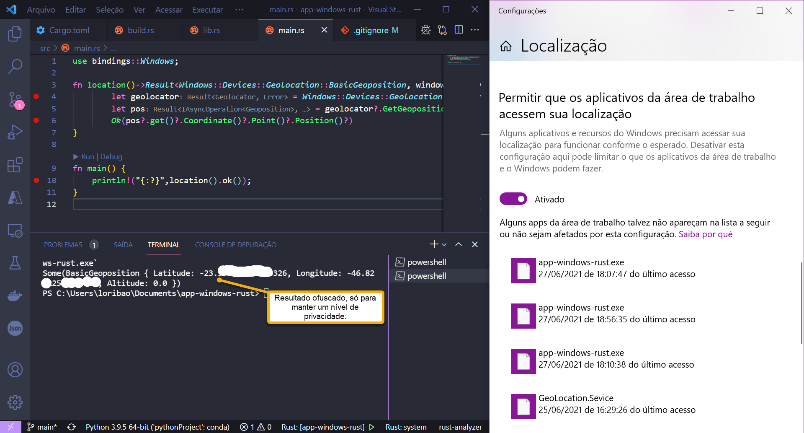

# Rust for Windows

Consumindo a api de geolocalização do Windows em rust, o código é simples porém o processo de aprendizagem até esse ponto demandou algumas horas de estudos da linguagem e também das libs relacionadas.

Material de estudo:
- https://www.youtube.com/watch?v=IxqOLScujUg&t=2103s
- https://github.com/microsoft/windows-rs
- https://lib.rs/crates/windows
- https://microsoft.github.io/windows-docs-rs/doc/bindings/Windows/ApplicationModel/Appointments/struct.AppointmentProperties.html#method.Location
- https://docs.microsoft.com/en-us/uwp/api/windows.devices.geolocation?view=winrt-20348
- https://www.youtube.com/watch?v=L7KQ3MpTrI4&list=PLfARWHCVecK8Kp8Xc5UBu3lSEpvmWot-u
